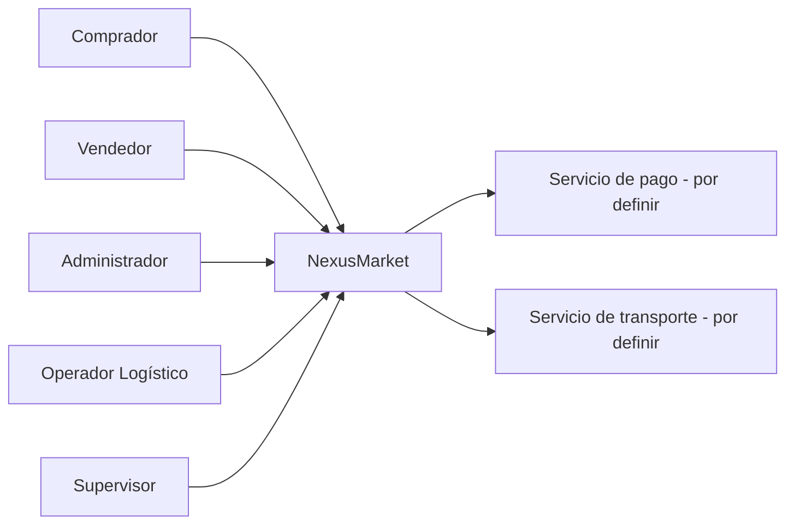

# C4 Nivel 1 — Contexto

## Propósito
Mostrar a NexusMarket y sus participantes externos.

```mermaid
flowchart LR
 Buyer[Comprador] --> NM[NexusMarket]
 Seller[Vendedor] --> NM
 Admin[Administrador] --> NM
 Ops[Operador Logístico] --> NM
 Sup[Supervisor] --> NM
 NM --> Pay[Servicio de pago - por definir]
 NM --> Carrier[Servicio de transporte - por definir]
```

Los servicios de pago y transporte son posibles integraciones, no proveedores definidos por la fuente.
