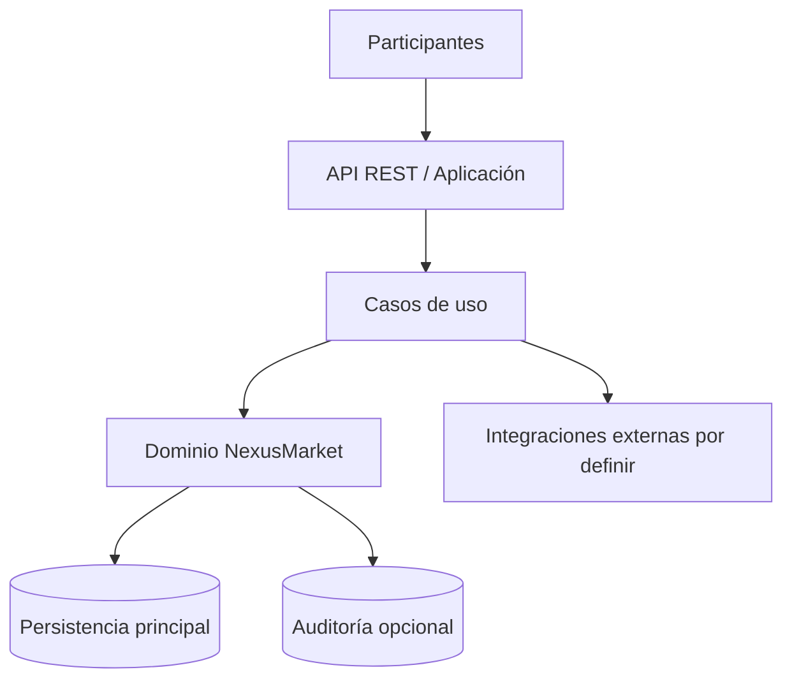

# C4 Nivel 2 — Contenedores

```mermaid
flowchart TB
 U[Participantes] --> WEB[API REST / Aplicación]
 WEB --> APP[Casos de uso]
 APP --> DOM[Dominio NexusMarket]
 DOM --> DB[(Persistencia principal)]
 DOM --> AUD[(Auditoría opcional)]
 APP --> EXT[Integraciones externas por definir]
```

La tecnología y los motores de almacenamiento son decisiones técnicas pendientes.
