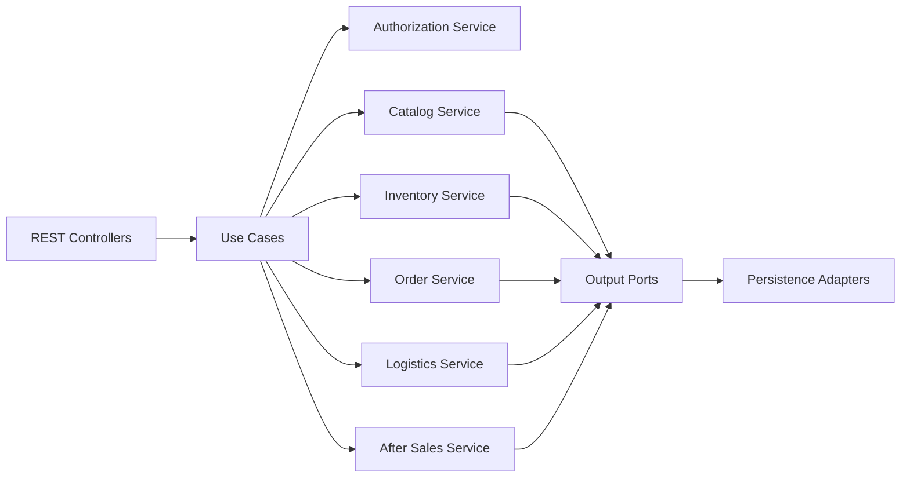

# C4 Nivel 3 — Componentes

```mermaid
flowchart LR
 REST[REST Controllers] --> UC[Use Cases]
 UC --> AUTH[Authorization Service]
 UC --> CAT[Catalog Service]
 UC --> INV[Inventory Service]
 UC --> ORD[Order Service]
 UC --> LOG[Logistics Service]
 UC --> AFTER[After Sales Service]
 CAT --> PORT[Output Ports]
 INV --> PORT
 ORD --> PORT
 LOG --> PORT
 AFTER --> PORT
 PORT --> PERSIST[Persistence Adapters]
```
